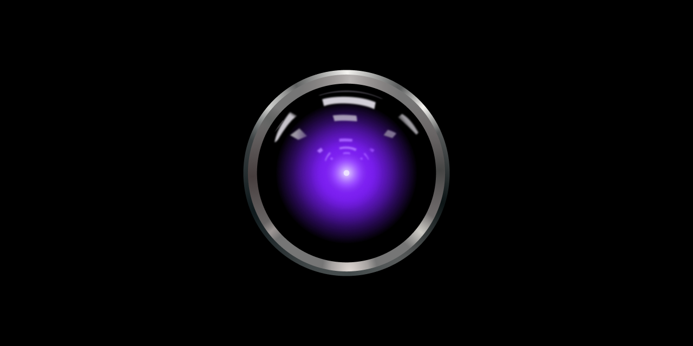
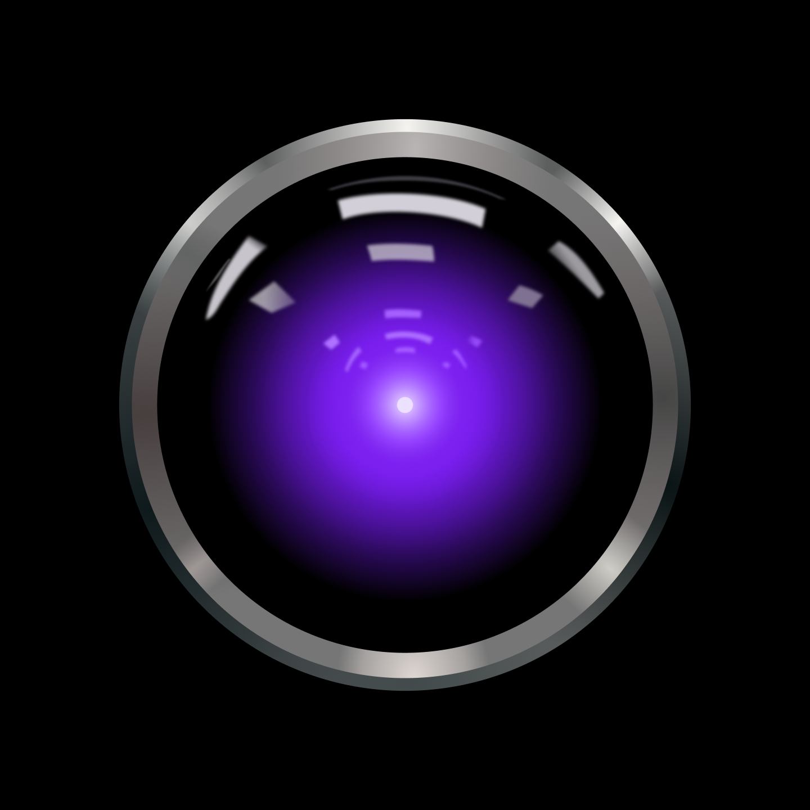

# HAL 12000 // Visual Identity

_Figma designs [here](https://www.figma.com/file/4r5EO3RqFpsVWiyNC5MBLt/HAL-12000)._

## GitHub social preview banner

## Slack profile picture

## _Attribution_

The purple eye is based on a [vector rendition of HAL 9000's eye created by Cryteria](https://commons.wikimedia.org/wiki/File:HAL9000.svg), licensed under the Creative Commons Attribution 3.0 Unported license.
